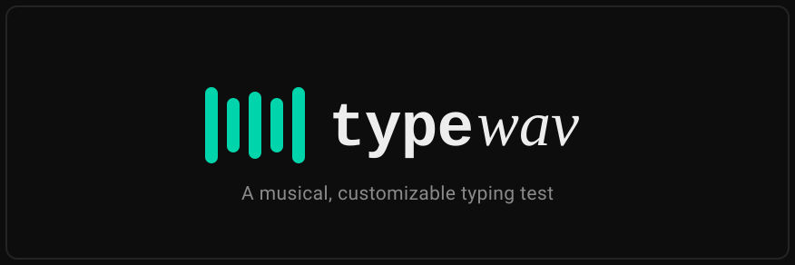

<p align="center">
  
</p>

<p align="center">
  <a href="https://www.typescriptlang.org"></a>
  <a href="https://react.dev"></a>
  <a href="https://nextjs.org"></a>
  <a href="https://tailwindcss.com"></a>
  <a href="https://tonejs.github.io"></a>
  <a href="https://zustand.docs.pmnd.rs"></a>
  <a href="https://motion.dev"></a>
  <a href="https://recharts.org"></a>
  <a href="https://next-intl.dev"></a>
  <a href="https://vitest.dev"></a>
  <a href="https://pnpm.io"></a>
  <a href="https://eslint.org"></a>
  <a href="https://vercel.com"></a>
</p>

<p align="center">
  <b>A musical, customizable typing test.</b> Every correct keystroke plays the next note of a real
  piano piece; a mistake plays nothing, never a wrong note.
</p>

<p align="center">
  <a href="https://typewav.mouwaficbdr.me">Live app</a>
  &nbsp;·&nbsp;
  <a href="#how-the-music-works">How the music works</a>
  &nbsp;·&nbsp;
  <a href="#credits">Credits</a>
</p>

---

## What it is

TypeWav is a typing trainer with the usual apparatus (multiple modes, per-session stats, themes,
instant feedback on every typo) built around one idea: the reward for typing well is a melody, not a
number.

Each `.mid` file is a real piece of music. As you type, every **correct** keystroke advances the
sequencer and plays the **next note** of that piece. A **wrong** keystroke produces **silence**,
never a wrong note. Correcting with Backspace resumes the music with a short reverb cue. The tempo
follows your typing speed; the octave moves in a fixed pattern per word. The piece only sounds
right when you type right.

Everything runs in the browser. No account, no server: your history, records and preferences live
in IndexedDB, and you can export or import the lot as a single JSON file. Interface in French
(default) and English.

## Features

- **Modes**: Time, Words, Quote, Code, Ghost (race your own best run), Free (your own text),
  Zen (no timer, no score), and a guided Learning mode.
- **Five text collections**: literature, poetry, philosophy, gaming, code. Every entry is public
  domain or royalty-free, with a verifiable source and its language noted (criteria in
  [`CONTRIBUTING.md`](CONTRIBUTING.md)).
- **Reactive tempo**: `warp-engine` stretches note durations to your live WPM; `note-expression`
  colours the melody with a fixed octave pattern indexed by word number.
- **Honest metrics**: headline WPM uses the word-level definition (only characters of fully
  correct words count), with raw WPM, accuracy, consistency and per-bigram slowdowns alongside.
- **Local-first**: IndexedDB only, one-file export/import, `navigator.storage.persist()` on open.
- **Themes**: several, all unlocked, CSS-variable driven with no flash of the wrong theme on load.
- **Accessible**: keyboard-only operation, live regions for screen readers, `prefers-reduced-motion`
  respected, WCAG AA contrast.

## How the music works

The audio engine is split so that Tone.js stays strictly client-side.

```
apps/web/public/midi/*.mid
   |  fetch + parse (@tonejs/midi), mark phrase boundaries, cache in IndexedDB
   v
apps/web/lib/midi-asset-loader.ts
   |
   v
packages/audio-engine/src/midi-player.ts   (module-level sequencer state)
   |  advanceAndGetNote() on each correct keystroke, wraps around at the end
   v
apps/web/hooks/useAudioEngine.ts           ('use client', lazy-imports `tone`)
   |  Tone.start() only after a real keydown (Web Audio constraint)
   v
Tone.js sampler
   |-- warp-engine.ts       (WPM to BPM: the tempo reacts to your typing)
   `-- note-expression.ts   (fixed octave pattern indexed by word number)
```

`packages/audio-engine/src/engine.ts` defines only the `AudioEngine` **interface**; the Tone.js
**implementation** lives in the web app. See [`docs/MELODY_VERIFICATION.md`](docs/MELODY_VERIFICATION.md).

## Getting started

Requires **Node ≥ 20.19.0** and **pnpm 9+**. Run from the repo root.

```bash
pnpm install
pnpm dev          # next dev --turbopack, http://localhost:3000
pnpm build        # production build (apps/web)
pnpm typecheck    # tsc --noEmit across every workspace
pnpm lint         # eslint, zero warnings tolerated
pnpm test         # vitest run (3 projects: unit / web-lib / web-components)
```

The app runs with **no environment variables**: v1 has no accounts and no backend, everything is
local to the browser.

## Project layout

pnpm workspaces: `apps/*`, `packages/*`, `tools/*`.

| Path | Package | What |
| --- | --- | --- |
| `apps/web` | `@typewav/web` | The Next.js 16 app (App Router, React 19). The only deployable. |
| `packages/audio-engine` | `@typewav/audio-engine` | Framework-agnostic music/MIDI logic: the canonical `MUSIC_LIBRARY`, the sequencer, the catalog, the engine interface. |
| `packages/types` | `@typewav/types` | Shared domain types. |
| `packages/collections` | `@typewav/collections` | Text collections + selection logic. |
| `packages/soundpacks` | `@typewav/soundpacks` | Sound pack configs. |
| `packages/themes` | `@typewav/themes` | Theme configs. |
| `tools/cli` | `create-typewav` | Scaffolding CLI for new themes / soundpacks / collections. |

Workspace packages export raw `.ts`; Next transpiles them via `transpilePackages`.

## Contributing

See [`CONTRIBUTING.md`](CONTRIBUTING.md) for the per-type contribution rules, especially the
public-domain / royalty-free criteria for any text or audio addition.

## Credits

TypeWav owes a lot to [**Monkeytype**](https://github.com/monkeytypegame/monkeytype). Its clarity,
restraint and focus were the reference and the case study throughout the build. Thank you to its
team and contributors.

## License

The code is released under the [MIT License](LICENSE).

The bundled `.mid` files and audio samples are not covered by that license: they remain the
property of their respective rights holders and ship here only so the app can play. The text
collections are public domain (criteria in [`CONTRIBUTING.md`](CONTRIBUTING.md)).
